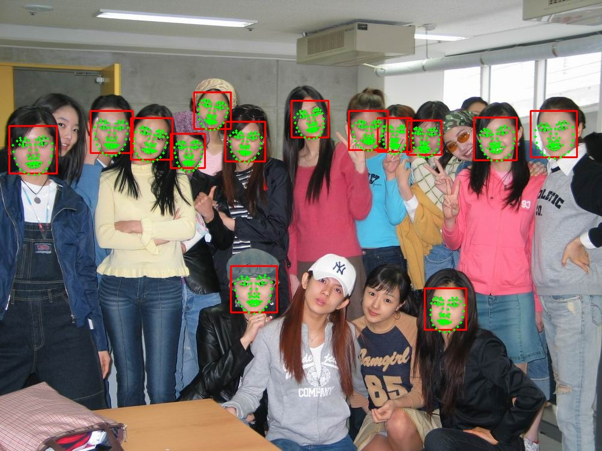
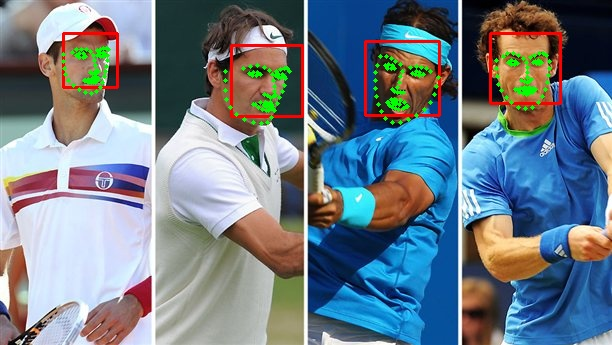

LBF
=========================

C++ implementation of Face Alignment at 3000 FPS via Regressing Local Binary Features.


### Build the project

We only need [OpenCV][opencv] and [CMake][cmake] to build the project.

```
$ cd lbf
$ cmake -D CMAKE_BUILD_TYPE=Release ./
```

If you are on Linux, simply use `make` to compile the project. If you are on Windows, you may compile using [Visual Studio][vs]. When the compile completed, it will make an executable file named as `lbf`.

### Prepare Data

We can download dataset from [here][dataset]. The dataset contains 68 points for every face, however it doesn't provide a bounding box for faces. We need a face detector to generate face bounding box (The haar-like cascade detection provided by OpenCV is a good choice ).

Download the dataset and extract the data (xxx.jpg and xxx.pts) to the directory e.g. `/home/test/dataset/afw`. We also need one text file `Path_Images_train.txt`to list the images used for training. The `dir` command on Windows and `find`command on Linux could do this job. Simply run the command on Linux: 
```
$ find /home/test/dataset/afw/ -name "*jpg"  > /home/test/dataset/afw/Path_Images_train.txt
```

When `Path_Images_train.txt` is prepared, we also need one text file `train.txt`. Each line of the text file points out an image path and face bounding box in this image with facial points location. We use VJ detector provided by OpenCV. Run `lbf prepare` command to generate the text file `train.txt`:
```
$ ./lbf prepare /home/test/dataset/afw/Path_Images_train.txt haarcascade_frontalface_alt.xml  train.txt
```
- **/home/test/dataset/afw/Path_Images_train.txt**: the whole path that holds `Path_Images_train.txt`
- **haarcascade_frontalface_alt.xml**: OpenCV haar-like face detect model
- **train.txt**: output file that holds image path and face bounding box in this image with facial points location

### Train

The command `$ ./lbf train` will start training from text file `train.txt`and saving model  into file e.g. `my.model`
```
$ ./lbf train train.txt my.model 
```
- **train.txt**: text file generated by `$ ./lbf prepare` command
- **my.model**: save model file


### Face alignment on image
The command `$ ./lbf live` will find faces on input image and locate  facial points. 
```
$ ./lbf live my.model haarcascade_frontalface_alt.xml test.jpg
```
- **my.model**: pre-trained model file
- **haarcascade_frontalface_alt.xml**: OpenCV haar-like face detect model
- **test.jpg**: input image

### Face alignment on camera
The command `$ ./lbf camera` will find faces from you camera and locate  facial points. 
```
$ ./lbf camera my.model haarcascade_frontalface_alt.xml 0
```
- **my.model**: pre-trained model file
- **haarcascade_frontalface_alt.xml**: OpenCV haar-like face detect model
- **0**: camera index

### Pre-trained Model

I provide some pre-trained models which you can find from the directory `model`.

### Some Test





### Reference

- [Datasets][dataset]
- [Face Alignment at 3000 FPS via Regressing Local Binary Features](http://research.microsoft.com/en-US/people/yichenw/cvpr14_facealignment.pdf)
- [jwyang/face-alignment](https://github.com/jwyang/face-alignment)
- [yulequan/face-alignment-in-3000fps](https://github.com/yulequan/face-alignment-in-3000fps)

[dataset]: http://ibug.doc.ic.ac.uk/resources/facial-point-annotations
[opencv]: http://opencv.org/
[cmake]: http://www.cmake.org/
[vs]: https://www.visualstudio.com/
